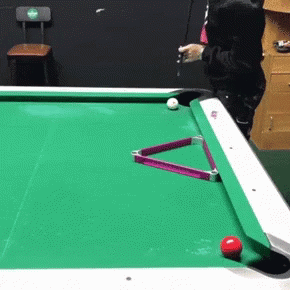

# Magic 8-Ball
APA Discord Bot for Wookie Mistakes Team

## Commands
### Lineups
`!line 23454567`

This command returns all eligible lineups for the first 8 given numbers in the message ranged between 1-9 to the #strategy channel.
### SL Matchups
`!sl`

This command returns the expected points of every skill level matchup to the #strategy channel in both markdown text and links.

The embedded links have averages, medians, and modes for each skill level matchup.
and a link to the [heatmap](https://raw.githubusercontent.com/berryscottr/magic-8ball/main/data/images/slMatchupAverages.svg).
### Lineups
`!inn`

This command returns everyone's effective innings per game towards their handicap to the #strategy channel.
### Optimal Lineup
`!opt 65543 22235567`

This command returns the highest expected points lineups for that the second array (first 8) of numbers can 
respond to the first array (first 5) of numbers in the message. For this command to work, the arrays must be space separated.
There is also about 15 seconds of delay until a response.
### Optimal Playoff Lineup
`!play 65543 22235567`

This command returns the highest differential expected points lineups for that the second array (first 8) of numbers can
respond to the first array (first 5) of numbers in the message. For this command to work, the arrays must be space separated.
There is also about 15 seconds of delay until a response.
### Game Day 8-Ball
`!8game Wookie Mistakes`

This command returns a game day announcement to the #game-night-8 channel that tracks incoming reactions for attendance.

### Game Day 9-Ball
`!9game Wookie Mistakes`

This command returns a game day announcement to the #game-night-8 channel that tracks incoming reactions for attendance.

## Dev Notes
- This bot is hard-coded to restart every 6th hour of the day in UTC time to enable full-time Github Workflow Action hosting.